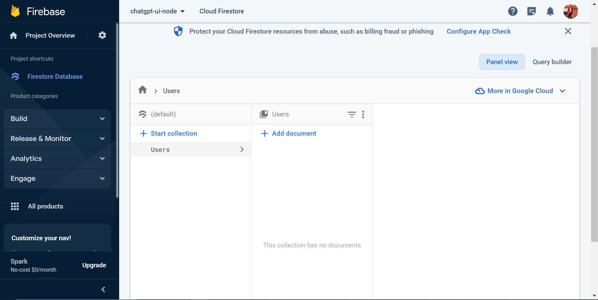

Migrating GPT-Django project to GPT-Node-Firebase

1. Set up the node server using express
2. configure the routes and data models for different components-account,chat and chatgpt_ui_server
   
   How can we update the back end application to allow multiple users to share one chat?
   --> We can make use of web sockets to allow users to connect to a particular chat using an identifier for the chat so that every update made by a user or the server will be pushed to all the users connected to the chat.

Integrating the existing Vue front end code with the nodejs-firebase backed.
-->Once developed all the components can work the same way the Django code was working with some updates to how the data is being handled due to NoSQL database and NodeJS. We can make use of JsonWebToken more effieciently in authentication as smoother integration is provided for NodeJS. We can intoduce cors or proxies to handle the URLs for backend.
